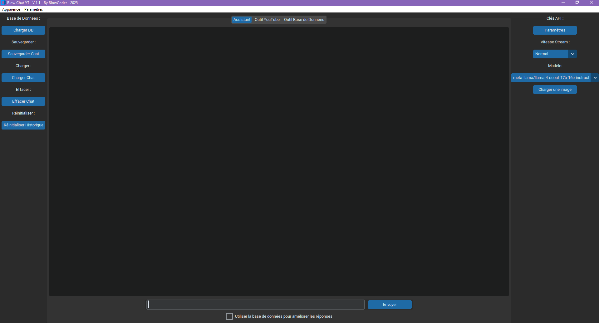
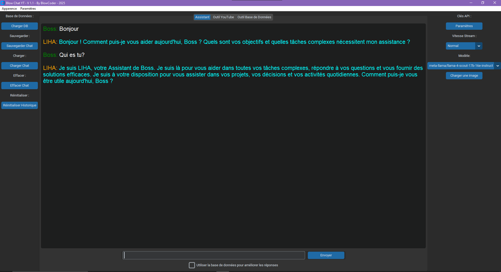
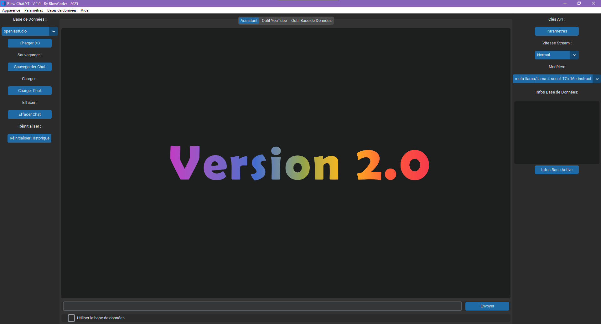
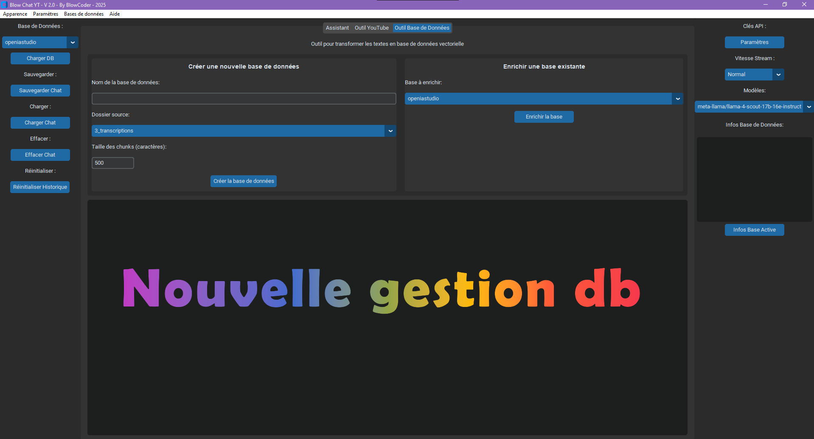

# Blow Chat YT v1.1

## Réseaux

- Chaine Youtube
  - [Open IA Studio](https://www.youtube.com/@openiastudio)
- Skool
  - [IA Mastery](https://www.skool.com/@blow-dok-9542?g=ia-mastery)

## Screenshot





## 📋 Sommaire

- [Description](#-description)
- [Fonctionnalités principales](#-fonctionnalités-principales)
- [Release](#-release-v2.0)
- [Technologies utilisées](#-technologies-utilisées)
- [Prérequis](#-prérequis)
- [Installation](#-installation)
  - [Méthode 1 : Téléchargement direct](#méthode-1--téléchargement-direct-sans-git)
  - [Méthode 2 : Avec Git](#méthode-2--avec-git-optionnel)
  - [Configuration de l'environnement](#configuration-de-lenvironnement-pour-les-deux-méthodes)
- [Utilisation](#-utilisation)
- [Personnalisation](#-personnalisation)
- [Structure des fichiers](#-structure-des-fichiers)
- [Architecture](#-architecture)
- [Fonctionnalités détaillées](#-fonctionnalités-détaillées)
- [Confidentialité](#-confidentialité)
- [Contribution](#-contribution)
- [Licence](#-licence)

## 📝 Description

Blow Chat YT est un assistant conversationnel intelligent basé sur l'IA qui vous aide à analyser et interagir avec du contenu textuel et des transcriptions vidéo YouTube. Développé avec Python et une interface graphique moderne, Blow Chat YT offre une expérience utilisateur intuitive tout en intégrant des technologies avancées d'IA.

## ✨ Fonctionnalités principales

- **Assistant conversationnel avancé** :
  Interagissez avec l'IA grâce à l'intégration de modèles de langage puissants via l'API Groq
- **Analyse de vidéos YouTube** :
  Télécharger et analyser les transcriptions de vidéos YouTube via une base de donnée vectorielle
- **Recherche sémantique** :
  Utilisez une base de données vectorielle (FAISS) pour rechercher efficacement dans vos documents
- **Personnalisation complète** :
  - Modifiez les couleurs de l'interface
  - Ajustez la taille de la police
  - Personnalisez le nom et le rôle de l'assistant
  - Choisissez la vitesse d'affichage des réponses (de Lent à Turbo)
- **Gestion de l'historique des conversations** :
  Sauvegardez et chargez vos conversations précédentes
- **Génération de rapports** :
  Créez des rapports markdown à partir des transcriptions analysées
- **Gestion robuste des bases de données** :
  Créez, enrichissez et gérez facilement vos bases de connaissances vectorielles
- **Fermeture sécurisée de l'application** :
  Fermeture propre sans erreurs "bgerror" ni processus orphelins
- **Enrichissement intelligent des bases de données** :
  Évite les doublons en ignorant automatiquement les fichiers déjà présents dans la base

## 💎 Release v2.0





Version Optimisée – Présentation Blow Chat YT V2.0 :
La version 2.0 frappe fort avec une architecture modulaire, plus robuste, parfaitement structurée, pensée pour offrir :

- 👉 une meilleure maintenabilité
- 👉 une évolutivité à long terme
- 💡 Plusieurs axes d'amélioration ont été mis en place pour booster l'expérience utilisateur :

### ✅ Les nouveautés majeures :

- 🔹 Créer des bases de données totalement indépendantes les unes des autres
- 🔹 Enrichir dynamiquement une base existante
- 🔹 Sélectionner un dossier source personnalisé pour vos documents
- 🔹 Obtenir des infos détaillées sur chaque base de données
- 🔹 Régler la taille des chunks directement via l'interface
- 🔹 Choisir la base avec laquelle interagir en un clic via menu déroulant

Cette V2.0, c'est plus de contrôle, plus de clarté dans les mains des utilisateurs.
La mise à jour vous donne les clés travailler proprement !

### Problème possible avec Linux

Si vous rencontrez des problèmes d'installation ou de fonctionnement essayer ceci :

- Dans le fichier interface.py commenté la ligne 590 :
  - settings_window.grab_set() # Rendre la fenêtre modale
- Ajouter les dépendances tkinter et hugging face via le terminal et assurez vous d'avoir activé l'environnement virtuel :

```bash
apt-get install python3-tk
pip install hf_xet
```

## 🔧 Technologies utilisées

- **Python** :
  Langage principal de développement
- **CustomTkinter** :
  Framework moderne pour l'interface graphique
- **LangChain** :
  Framework pour les applications d'IA
- **FAISS** :
  Bibliothèque de recherche de similarité vectorielle
- **SentenceTransformers** :
  Modèles de plongement (embeddings) pour le traitement du langage naturel
- **YouTube Transcript API** :
  Pour extraire les transcriptions de vidéos YouTube
- **API Groq** :
  Pour accéder aux modèles de langage avancés comme Llama 4, deepseek-r1-distill-qwen-32b, et bien d'autres
- **API Hugging Face** :
  Pour accéder aux modèles de plongement (embeddings)

## 📋 Prérequis

- Python 3.8+ installé
  - Téléchargez ici [Python](https://www.python.org/downloads/) puis l'installer
  - Autre recommandation [Anaconda Navigator](https://www.anaconda.com/download/success)
- Git (optionnel)
  - Téléchargez ici [Git](https://git-scm.com/)
- Une clé API Groq pour accéder aux modèles de langage
  - Créez un compte sur [GroqCloud](https://console.groq.com/home) pour obtenir votre clé API
  - L'inscription est gratuite et vous donne accès à divers modèles de langage performants
- Une clé API YouTube pour les fonctionnalités YouTube (extraction de transcriptions et métadonnées)
  - Créez un compte sur [Google Cloud Console](https://console.cloud.google.com/) (c'est gratuit)
  - Créez un projet et activez l'API YouTube Data v3
  - Générez une clé API dans la section "Identifiants"
  - Pour plus de détails, consultez la [documentation officielle](https://developers.google.com/youtube/v3/getting-started)
- Tutoriel vidéo pour les clés API
  - Si vous avez des difficultés pour créer les clés API, voici le tutoriel [Video YouTube](https://www.youtube.com/watch?v=Pzr_bc9OOFw)
- Une clé API Hugging Face pour accéder aux modèles de plongement (embeddings)
  - Créez un compte sur [Hugging Face](https://huggingface.co/) pour obtenir votre token
  - Accédez à votre [profil](https://huggingface.co/settings/tokens) pour générer un token d'accès
  - Ce token est nécessaire pour télécharger les modèles sentence-transformers

## 🚀 Installation

### Méthode 1 : Téléchargement direct (sans Git)

1. Téléchargez l'application en cliquant sur le bouton vert "Code" en haut sur cette page GitHub, puis "Download ZIP", et enregister sur votre bureau
2. Extraire le fichier ZIP sur votre bureau avec winrar (PC) ou l'outil d'extraction intégré (Mac)

- Téléchargez ici [Winrar](https://www.win-rar.com/predownload.html?&L=10) si nécessaire

3. Ouvrez une invite de commande ou un terminal et entrez ces commandes

```bash
cd Desktop
cd Blow-Chat-YT-master
```

### Méthode 2 : Avec Git (optionnel)

1. Si vous avez Git installé, clonez ce dépôt :

2. Ouvrez une invite de commande ou un terminal et entrez ces commandes

```bash
cd Desktop
git clone https://github.com/Blowdok/Blow-Chat-YT.git
cd Blow-Chat-YT
```

### Configuration de l'environnement (pour les deux méthodes)

1. Créez et activez un environnement virtuel :

**Sous Windows :**

```bash
python -m venv myvenv
myvenv\Scripts\activate
```

Lorsque l'environnement est activé vous devriez voir (myenv) au début du chemin dans le terminal

**Sous macOS/Linux :**

```bash
python3 -m venv myvenv
source myvenv/bin/activate
```

2. Installez les dépendances :

```bash
pip install -r requirements.txt
```

Note : Veuillez patienter pendant l'installation des dépendances, cela peut prendre un moment.

3. Configurez vos clés API :
   - Modifiez le fichier `config.ini` ou entrez vos clés directement dans l'application
   - Pour l'API Groq, connectez-vous sur [console.groq.com](https://console.groq.com/home) et générez votre clé API dans la section "API Keys"
   - Pour l'API YouTube, suivez les étapes dans la [console Google Cloud](https://console.cloud.google.com/) pour activer l'API YouTube Data v3 et générer une clé API
   - Pour l'API Hugging Face, connectez-vous sur [huggingface.co](https://huggingface.co/settings/tokens) et générez un token d'accès dans votre profil

## 💻 Utilisation

1. Lancez l'application :

```bash
python app.py
```

2. L'interface principale s'affiche avec :

   - Zone de conversation pour interagir avec l'assistant
   - Barre latérale avec outils et options
   - Menu pour accéder aux paramètres et fonctionnalités avancées
   - Choix du modèle (par défaut : meta-llama/llama-4-scout-17b-16e-instruct)

3. Utilisez les fonctionnalités des 3 onglets :
   - **Assistant** : Posez des questions à l'assistant, avec ou sans base de donnée
   - **Outil YouTube** : Pour télécharger des transcriptions de vidéo YT, soit des vidéos spécifiques, soit toutes les vidéos d'une chaîne
   - **Outil bases de données** :
   - Créer une base de donnée vectorielle avec les transcriptions de vidéos recueillies par Outil YouTube (dossier source: 3_transcription) ou avec vos propres documents (ajouter un dossier source via le menu Base de données)
   - Vous pouvez aussi enrichir une base existante (dans le menu déroulant) avec de nouvelles sources
   - Lors de l'enrichissement, les fichiers déjà présents dans la base sont automatiquement ignorés pour éviter les doublons
4. Base de données (barre latérale gauche):

   - Pour utiliser une base de données, sélectionnez-la dans le menu déroulant et cliquez sur "Charger DB"
   - Cochez "Utiliser la base de données" pour intégrer le contenu de la base dans vos conversations

5. Fermeture de l'application :
   - Utilisez le bouton de fermeture de fenêtre normal ou tapez "exit" dans la zone de conversation
   - L'application se fermera proprement, sans erreurs ni processus fantômes

## 🎨 Personnalisation

L'application peut être entièrement personnalisée via le menu Paramètres :

- **Apparence** : Choisissez parmi différents thèmes et tailles de police
- **Couleurs** : Personnalisez les couleurs de texte pour chaque élément
- **Assistant** : Modifiez le nom, le rôle et l'objectif de l'assistant
- **Vitesse** : Ajustez la vitesse d'affichage des réponses (Lent, Normal, Rapide, Très Rapide, Turbo)
- **API** : Configurez vos clés API

Le fichier `config.ini` offre également de nombreuses options de personnalisation avancées.

## 📁 Structure des fichiers

- `interface.py` : Module de l'interface graphique
- `app.py` : Module principal contenant la logique métier
- `config.ini` : Fichier de configuration avec sections détaillées
- `requirements.txt` : Liste des dépendances
- `LICENSE` : Droit sur l'application
- `README.md` : Information sur l'application
- `screenshot` : Dossier de capture d'image de l'application
- `source_doc` : Dossier pour mettre vos propres documents
- Dossiers créés automatiquement :
  - `1_history_pkl` : Historique des conversations
  - `2_conversation_txt` : Conversations exportées
  - `3_transcriptions` : Transcriptions de vidéos
  - `4_markdown_reports` : Rapports générés
  - `5_database` : Base de données vectorielle

## 🏗️ Architecture

L'application est structurée selon une architecture modulaire :

- **Interface utilisateur** (`interface.py`) :

  - Gère l'affichage et les interactions avec l'utilisateur
  - Implémente tous les widgets et menus
  - Communique avec la logique métier via des callbacks
  - Gère les tâches asynchrones de manière sécurisée

- **Logique métier** (`app.py`) :

  - Contient toutes les fonctionnalités principales
  - Gère la communication avec les API externes
  - Traite et stocke les données
  - Implémente les algorithmes de recherche vectorielle
  - Inclut des mécanismes de sécurité contre les erreurs Tkinter

- **Configuration** (`config.ini`) :
  - Centralise tous les paramètres de l'application
  - Sections bien organisées et commentées
  - Facilite la personnalisation sans modifier le code source
  - Sauvegarde automatique des préférences utilisateur

Cette architecture permet une meilleure maintenabilité et facilite l'extension des fonctionnalités.

## 📚 Fonctionnalités détaillées

### Analyse de vidéos YouTube

Blow Chat YT peut extraire et analyser les transcriptions de vidéos YouTube, créer une base de données de connaissances à partir de ces transcriptions, et générer des rapports détaillés.

### Recherche sémantique

L'application utilise FAISS et SentenceTransformers pour créer une base de données vectorielle, permettant de faire des recherches sémantiques avancées dans les documents que vous partagez et transcriptions indexés.

### Gestion des bases de données

La version 2.0 améliore significativement la gestion des bases de données :

- Création de bases à partir de diverses sources
- Enrichissement intelligent avec détection des doublons (les fichiers déjà indexés sont ignorés)
- Visualisation des métadonnées des bases (nombre de documents, date de création, etc.)
- Gestion des sources de données multiples

### Streaming intelligent des réponses

L'application affiche les réponses de l'IA en mode streaming (progressif) avec cinq vitesses ajustables :

- Lent : Pour une lecture confortable
- Normal : Vitesse équilibrée
- Rapide : Pour un affichage plus dynamique
- Très Rapide : Pour les utilisateurs pressés
- Turbo : Affichage quasi instantané

### Interface personnalisable

L'interface utilisateur peut être entièrement personnalisée selon vos préférences en termes de couleurs, police et style général.

### Robustesse améliorée

La version 2.0 introduit de nombreuses améliorations de stabilité :

- Fermeture propre sans erreurs "bgerror" ni processus orphelins
- Gestion améliorée des tâches asynchrones
- Meilleure gestion des exceptions
- Sauvegarde automatique des paramètres et de l'historique

## 🔒 Confidentialité

Toutes les données sont stockées localement sur votre machine. Les seules connexions externes sont faites vers les API Groq et YouTube pour les fonctionnalités qui en dépendent.

## 🤝 Contribution

Les contributions sont les bienvenues ! N'hésitez pas à ouvrir une issue ou une pull request pour améliorer Blow Chat YT.

## 📄 Licence

Ce projet est sous licence [MIT](LICENSE).

### Résolution des problèmes d'authentification Hugging Face

Si vous rencontrez cette erreur :

```
401 Client Error: Unauthorized for url: https://huggingface.co/sentence-transformers/all-MiniLM-L6-v2/resolve/main/config.json
```

Assurez-vous d'avoir ajouté votre token Hugging Face dans la section [API_KEYS] du fichier config.ini :

```ini
[API_KEYS]
huggingface_token = hf_votre_token_ici
```

Vous pouvez également l'ajouter directement via l'interface graphique dans le menu Paramètres > Paramètres.
