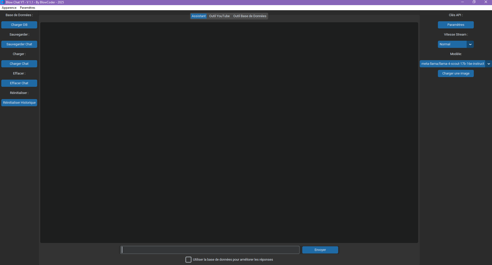
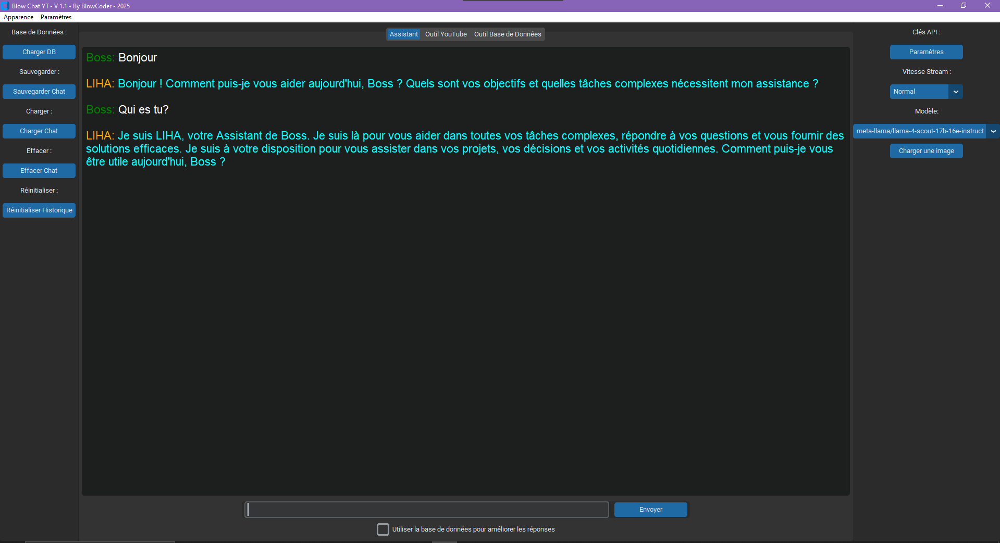

# Blow Chat YT





## 📝 Description

Blow Chat YT est un assistant conversationnel intelligent basé sur l'IA qui vous aide à analyser et interagir avec du contenu textuel et des transcriptions vidéo YouTube. Développé avec Python et une interface graphique moderne, Blow Chat YT offre une expérience utilisateur intuitive tout en intégrant des technologies avancées d'IA.

## ✨ Fonctionnalités principales

- **Assistant conversationnel avancé** :
  Interagissez avec l'IA grâce à l'intégration de modèles de langage puissants via l'API Groq
- **Analyse de vidéos YouTube** :
  Téléchargez et analysez automatiquement les transcriptions de vidéos YouTube
- **Recherche sémantique** :
  Utilisez une base de données vectorielle (FAISS) pour rechercher efficacement dans vos documents
- **Personnalisation complète** :
  - Modifiez les couleurs de l'interface
  - Ajustez la taille de la police
  - Personnalisez le nom et le rôle de l'assistant
- **Gestion de l'historique des conversations** :
  Sauvegardez et chargez vos conversations précédentes
- **Génération de rapports** :
  Créez des rapports markdown à partir des transcriptions analysées

## 🔧 Technologies utilisées

- **Python** :
  Langage principal de développement
- **CustomTkinter** :
  Framework moderne pour l'interface graphique
- **LangChain** :
  Framework pour les applications d'IA
- **FAISS** :
  Bibliothèque de recherche de similarité vectorielle
- **SentenceTransformers** :
  Modèles de plongement (embeddings) pour le traitement du langage naturel
- **YouTube Transcript API** :
  Pour extraire les transcriptions de vidéos YouTube
- **API Groq** :
  Pour accéder aux modèles de langage avancés comme Llama 4, deepseek-r1-distill-qwen-32b, et bien d'autres

## 📋 Prérequis

- Python 3.8+ installé
  - Téléchargez ici [Python](https://www.python.org/downloads/) puis l'installer
  - Autre recommandation [Anaconda Navigator](https://www.anaconda.com/download/success)
- Git (optionnel)
  - Téléchargez ici [Git](https://git-scm.com/)
- Une clé API Groq pour accéder aux modèles de langage
  - Créez un compte sur [GroqCloud](https://console.groq.com/home) pour obtenir votre clé API
  - L'inscription est gratuite et vous donne accès à divers modèles de langage performants
- Une clé API YouTube pour les fonctionnalités YouTube (extraction de transcriptions et métadonnées)
  - Créez un compte sur [Google Cloud Console](https://console.cloud.google.com/)
  - Créez un projet et activez l'API YouTube Data v3
  - Générez une clé API dans la section "Identifiants"
  - Pour plus de détails, consultez la [documentation officielle](https://developers.google.com/youtube/v3/getting-started)

## 🚀 Installation

### Méthode 1 : Téléchargement direct (sans Git)

1. Téléchargez l'application en cliquant sur le bouton vert "Code" en haut sur cette page GitHub, puis "Download ZIP", et enregister sur votre bureau par exemple
2. Extraire le fichier rar sur votre bureau avec winrar (Pc) ou winzip (Mac)

- Téléchargez ici [Winrar](https://www.win-rar.com/predownload.html?&L=10) [WinZip Mac](https://www.winzip.com/en/product/winzip/mac/)

3. Ouvrez une invite de commande ou un terminal et entrer ses commandes

```bash
cd Desktop
cd Blow-Chat-YT
```

### Méthode 2 : Avec Git (optionnel)

1. Si vous avez Git installé, clonez ce dépôt :

2. Ouvrez une invite de commande ou un terminal et entrer ses commandes

```bash
cd Desktop
git clone https://github.com/Blowdok/Blow-Chat-YT.git
cd Blow-Chat-YT
```

### Configuration de l'environnement (pour les deux méthodes)

1. Créez et activez un environnement virtuel :

**Sous Windows :**

```bash
python -m venv myvenv
myvenv\Scripts\activate
```

Lorsque l'environnement est activé vous devriez voir (myenv) au début du chemin dans le terminal

**Sous macOS/Linux :**

```bash
python3 -m venv myvenv
source myvenv/bin/activate
```

2. Installez les dépendances :

```bash
pip install -r requirements.txt
```

3. Configurez vos clés API (c'est gratuit):
   - Modifiez le fichier `config.ini` ou entrez vos clés directement dans l'application
   - Pour l'API Groq, connectez-vous sur [console.groq.com](https://console.groq.com/home) et générez votre clé API dans la section "API Keys"
   - Pour l'API YouTube, suivez les étapes dans la [console Google Cloud](https://console.cloud.google.com/) pour activer l'API YouTube Data v3 et générer une clé API

## 💻 Utilisation

1. Lancez l'application :

```bash
python app.py
```

2. L'interface principale s'affiche avec :

   - Zone de conversation pour interagir avec l'assistant
   - Barre latérale avec outils et options
   - Menu pour accéder aux paramètres et fonctionnalités avancées
   - Choix du modèle (j'ai mis que 3 mais vous pouvez ajoutez les modèles de Groq que vous voulez à la ligne 963 du code). Vous trouverez les modèles ici [Models Groq](https://console.groq.com/docs/models)

3. Utilisez les fonctionnalités des 3 onglets :
   - **Assistant** : Posez des questions à l'assistant, avec ou sans base de donnée
   - **Outil YouTube** : Pour télécharger des transcriptions de vidéo YT, soit des vidéos spécifique, soit toutes les vidéos d'une chaine
   - **Outil bases de données** : Créer une base de donnée vectorielle avec les transcriptions recueillies par Outil YouTube

## 🎨 Personnalisation

L'application peut être entièrement personnalisée via le menu Paramètres :

- **Apparence** : Choisissez parmi différents thèmes et tailles de police
- **Couleurs** : Personnalisez les couleurs de texte pour chaque élément
- **Assistant** : Modifiez le nom, le rôle et l'objectif de l'assistant
- **API** : Configurez vos clés API

## 📁 Structure des fichiers

- `app.py` : Programme principal
- `config.ini` : Fichier sauvegarde de la configuration
- `requirements.txt` : Liste des dépendances
- `LICENSE` : Droit sur l'application
- `README.md` : Information sur l'application
- `screenshot` : Dossier de capture d'image de l'application
- Dossiers créés automatiquement :
  - `1_history_pkl` : Historique des conversations
  - `2_conversation_txt` : Conversations exportées
  - `3_transcriptions` : Transcriptions de vidéos
  - `4_markdown_reports` : Rapports générés
  - `5_database` : Base de données vectorielle

## 📚 Fonctionnalités détaillées

### Analyse de vidéos YouTube

Blow Chat YT peut extraire et analyser les transcriptions de vidéos YouTube, créer une base de données de connaissances à partir de ces transcriptions, et générer des rapports détaillés.

### Recherche sémantique

L'application utilise FAISS et SentenceTransformers pour créer une base de données vectorielle, permettant de faire des recherches sémantiques avancées dans les documents et transcriptions indexés.

### Interface personnalisable

L'interface utilisateur peut être entièrement personnalisée selon vos préférences en termes de couleurs, police et style général.

## 🔒 Confidentialité

Toutes les données sont stockées localement sur votre machine. Les seules connexions externes sont faites vers les API Groq et YouTube pour les fonctionnalités qui en dépendent.

## 🤝 Contribution

Les contributions sont les bienvenues ! N'hésitez pas à ouvrir une issue ou une pull request pour améliorer Blow Chat YT.

## 📄 Licence

Ce projet est sous licence [MIT](LICENSE).
